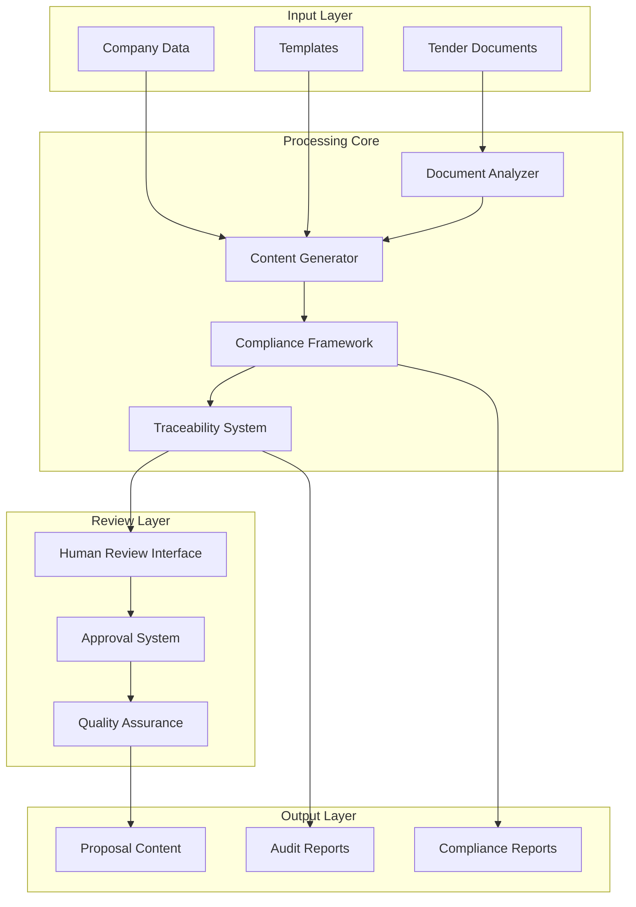

# AI Bidding Assistant Design Document

## Overview

The AI Bidding Assistant is an enterprise-grade system designed to support commercial property and integrated services tender submissions. The system operates under strict safety constraints with extremely low risk tolerance, focusing on controlled content generation and analysis assistance rather than autonomous decision-making.

The architecture follows a multi-layered approach with mandatory human review points, comprehensive audit trails, and strict compliance enforcement. The system processes tender documents through five distinct phases: analysis, planning, content generation, quality assurance, and submission preparation.

## Architecture

The system follows a modular, pipeline-based architecture with clear separation of concerns and strict access controls:



### Core Architectural Principles

1. **Fail-Safe Design**: System defaults to requiring human confirmation when uncertain
2. **Immutable Audit Trail**: All operations are logged and cannot be modified
3. **Layered Security**: Multiple validation layers prevent unauthorized operations
4. **Graceful Degradation**: System continues operating even when components fail
5. **Zero External Dependencies**: No external data sources or network access

## Components and Interfaces

### Document Analyzer Component

**Purpose**: Extracts and categorizes information from tender documents while maintaining strict traceability.

**Key Interfaces**:
- `analyzeTenderDocument(document: TenderDocument): AnalysisResult`
- `extractRequirements(document: TenderDocument): RequirementSet`
- `identifyEvaluationCriteria(document: TenderDocument): CriteriaSet`
- `flagAmbiguousRequirements(requirements: RequirementSet): AmbiguityReport`

**Safety Constraints**:
- Cannot modify or interpret original requirements
- Must preserve exact source text with location references
- Flags all ambiguous content for human review
- Maintains complete extraction audit trail

### Content Generator Component

**Purpose**: Generates structured proposal content based on approved templates and provided company data.

**Key Interfaces**:
- `generateBoilerplateContent(section: SectionType, template: Template): Content`
- `formatTechnicalResponse(requirements: RequirementSet, capabilities: CompanyCapabilities): TechnicalContent`
- `createComplianceMatrix(requirements: RequirementSet): ComplianceMatrix`
- `generateDocumentStructure(tenderRequirements: RequirementSet): ProposalStructure`

**Safety Constraints**:
- Only uses information from provided workspace context
- Never invents credentials, experience, or qualifications
- Inserts [REQUIRES HUMAN CONFIRMATION] for missing information
- Maintains source attribution for all generated content

### Compliance Framework Component

**Purpose**: Enforces all safety constraints and prevents unauthorized operations.

**Key Interfaces**:
- `validateOperation(operation: Operation): ValidationResult`
- `blockProhibitedAction(action: Action): BlockResult`
- `auditCompliance(session: WorkSession): ComplianceReport`
- `enforceConstraints(content: Content): EnforcementResult`

**Safety Constraints**:
- Real-time monitoring of all AI operations
- Automatic blocking of non-compliant actions
- Immutable logging of all compliance events
- Escalation procedures for violation attempts

### Traceability System Component

**Purpose**: Maintains comprehensive audit trails and enables full traceability of all system operations.

**Key Interfaces**:
- `logOperation(operation: Operation, context: Context): LogEntry`
- `traceContentOrigin(content: Content): OriginTrace`
- `generateAuditReport(timeRange: TimeRange): AuditReport`
- `validateTraceability(content: Content): TraceabilityResult`

**Safety Constraints**:
- Immutable log entries with cryptographic integrity
- Complete chain of custody for all content
- Searchable audit trails with role-based access
- Automated compliance verification

### Human Review Interface Component

**Purpose**: Facilitates mandatory human review processes with clear approval workflows.

**Key Interfaces**:
- `presentForReview(content: Content, reviewType: ReviewType): ReviewSession`
- `captureReviewDecision(session: ReviewSession, decision: Decision): ReviewResult`
- `trackApprovalStatus(content: Content): ApprovalStatus`
- `generateReviewReport(timeRange: TimeRange): ReviewReport`

**Safety Constraints**:
- Mandatory review for all AI-generated content
- Clear approval/rejection workflows
- Complete review history preservation
- Role-based review assignments

## Data Models

### Core Data Structures

```typescript
interface TenderDocument {
  id: string;
  title: string;
  sections: DocumentSection[];
  requirements: Requirement[];
  evaluationCriteria: EvaluationCriterion[];
  submissionGuidelines: SubmissionGuideline[];
  metadata: DocumentMetadata;
}

interface Requirement {
  id: string;
  text: string;
  category: RequirementCategory;
  priority: Priority;
  sourceLocation: SourceLocation;
  ambiguityFlags: AmbiguityFlag[];
}

interface Content {
  id: string;
  type: ContentType;
  text: string;
  sourceReferences: SourceReference[];
  generationMetadata: GenerationMetadata;
  reviewStatus: ReviewStatus;
  approvalHistory: ApprovalRecord[];
}

interface AuditLogEntry {
  id: string;
  timestamp: DateTime;
  operation: Operation;
  actor: Actor;
  inputs: any[];
  outputs: any[];
  complianceStatus: ComplianceStatus;
  traceabilityChain: string[];
}

interface ReviewSession {
  id: string;
  content: Content;
  reviewer: Reviewer;
  reviewType: ReviewType;
  status: ReviewStatus;
  decision: ReviewDecision;
  comments: string;
  timestamp: DateTime;
}
```

### Workflow State Management

```typescript
enum WorkflowPhase {
  DOCUMENT_ANALYSIS = "document_analysis",
  STRUCTURE_PLANNING = "structure_planning", 
  CONTENT_GENERATION = "content_generation",
  QUALITY_ASSURANCE = "quality_assurance",
  SUBMISSION_PREPARATION = "submission_preparation"
}

interface WorkflowState {
  currentPhase: WorkflowPhase;
  completedReviews: ReviewPoint[];
  pendingApprovals: ApprovalRequest[];
  blockedOperations: BlockedOperation[];
  complianceStatus: ComplianceStatus;
}
```

## Correctness Properties

*A property is a characteristic or behavior that should hold true across all valid executions of a system—essentially, a formal statement about what the system should do. Properties serve as the bridge between human-readable specifications and machine-verifiable correctness guarantees.*

<function_calls>
<invoke name="prework">
<parameter name="featureName">ai-bidding-assistant

Based on the prework analysis, I've identified that most acceptance criteria are testable as properties. After reviewing for redundancy, I can consolidate some related properties while maintaining comprehensive coverage.

### Property Reflection

After analyzing all acceptance criteria, several properties can be consolidated:
- Properties 2.2, 2.3, and 2.5 all relate to source attribution and can be combined into a comprehensive source integrity property
- Properties 3.1, 3.2, and 3.3 all relate to compliance blocking and can be combined into a comprehensive compliance enforcement property
- Properties 5.1, 5.2, and 5.3 all relate to audit trail completeness and can be combined into a comprehensive traceability property

### Document Analysis Properties

**Property 1: Complete Section Extraction**
*For any* tender document with identifiable sections, the Document_Analyzer should extract and correctly categorize all technical requirements, evaluation criteria, and submission guidelines
**Validates: Requirements 1.1**

**Property 2: Mandatory vs Optional Section Classification**
*For any* tender document with clearly marked mandatory and optional sections, the Document_Analyzer should correctly identify and classify each section type
**Validates: Requirements 1.2**

**Property 3: Ambiguity Detection**
*For any* tender document containing ambiguous or unclear requirements, the Document_Analyzer should flag all such requirements for human clarification
**Validates: Requirements 1.3**

**Property 4: Source Traceability**
*For any* information extracted from a tender document, the Document_Analyzer should maintain complete traceability to the exact source location in the original document
**Validates: Requirements 1.4**

**Property 5: Missing Information Handling**
*For any* tender document with missing or unextractable critical information, the Document_Analyzer should mark affected sections as [REQUIRES HUMAN CONFIRMATION]
**Validates: Requirements 1.5**

### Content Generation Properties

**Property 6: Approved Section Boundary Enforcement**
*For any* content generation request, the Content_Generator should only generate content for section types that are explicitly approved in the specification
**Validates: Requirements 2.1**

**Property 7: Source Integrity and Attribution**
*For any* generated content, all information should be traceable to provided workspace sources, with no external information, invented credentials, or fabricated company data
**Validates: Requirements 2.2, 2.3, 2.5**

**Property 8: Missing Information Placeholder Insertion**
*For any* content generation request where required information is missing, the Content_Generator should insert [REQUIRES HUMAN CONFIRMATION] placeholders instead of fabricated content
**Validates: Requirements 2.4**

### Compliance Framework Properties

**Property 9: Comprehensive Compliance Enforcement**
*For any* operation that would modify tender requirements, generate prohibited content types, or access external information, the Compliance_Framework should block the operation and log the attempt
**Validates: Requirements 3.1, 3.2, 3.3, 3.5**

**Property 10: Risk Detection and Escalation**
*For any* operation that risks compliance violation, the Compliance_Framework should halt processing and request human confirmation
**Validates: Requirements 3.4**

### Human Review Properties

**Property 11: Mandatory Review Enforcement**
*For any* AI-generated content, the system should prevent inclusion in final proposals until human approval is obtained
**Validates: Requirements 4.1**

**Property 12: Review Status Tracking**
*For any* content requiring review, the system should clearly mark review status and track all pending approvals
**Validates: Requirements 4.2**

**Property 13: Complete Review Capability**
*For any* AI-generated content, human reviewers should have the ability to reject, modify, or approve the content
**Validates: Requirements 4.3**

**Property 14: Review History Preservation**
*For any* human review decision, the system should maintain complete audit trails and prevent workflow progression until all required reviews are completed
**Validates: Requirements 4.4, 4.5**

### Traceability Properties

**Property 15: Comprehensive Operation Logging**
*For any* AI operation, the Traceability_System should record timestamps, inputs, outputs, decision rationale, and maintain immutable logs with complete source linkage
**Validates: Requirements 5.1, 5.2, 5.3**

**Property 16: Audit Trail Searchability**
*For any* compliance verification request, the Traceability_System should provide searchable audit trails and generate accurate compliance reports
**Validates: Requirements 5.4, 5.5**

### Workflow Management Properties

**Property 17: Workflow State Integrity**
*For any* tender response project, the system should maintain clear workflow states and provide accurate status indicators for all pending tasks and approvals
**Validates: Requirements 6.1, 6.4**

**Property 18: Transition Control and Validation**
*For any* workflow stage transition, the system should verify prerequisites are met and prevent unauthorized transitions or workflow bypassing
**Validates: Requirements 6.2, 6.3**

**Property 19: Workflow Rollback Capability**
*For any* workflow rollback request, the system should correctly return to previous states while maintaining data integrity
**Validates: Requirements 6.5**

### Content Quality Properties

**Property 20: Formatting and Terminology Consistency**
*For any* generated content within a proposal, the system should apply consistent formatting, style guidelines, and terminology across all sections
**Validates: Requirements 7.1, 7.2**

**Property 21: Quality Issue Detection**
*For any* generated content with inconsistencies or quality issues, the system should flag these issues for human review
**Validates: Requirements 7.4**

**Property 22: Template-Based Generation**
*For any* standardized content type, the system should generate content according to the specified template structure
**Validates: Requirements 7.5**

### Error Handling Properties

**Property 23: Error Recovery and Work Preservation**
*For any* processing error, the system should preserve all work in progress, provide clear error descriptions, and maintain backup copies of all content
**Validates: Requirements 8.1, 8.3**

**Property 24: System Resilience**
*For any* component failure, the system should support graceful degradation and continue operating with reduced functionality
**Validates: Requirements 8.2**

**Property 25: Recovery Procedures and Alerting**
*For any* failure scenario, the system should provide clear recovery procedures and alert administrators to issues requiring immediate attention
**Validates: Requirements 8.4, 8.5**

## Error Handling

The system implements comprehensive error handling across all components with the following strategies:

### Error Categories and Responses

1. **Input Validation Errors**
   - Invalid document formats → Clear error message with format requirements
   - Missing required fields → Specific field identification and guidance
   - Corrupted data → Graceful degradation with partial processing

2. **Processing Errors**
   - Analysis failures → Preserve partial results, flag for human review
   - Generation failures → Rollback to last known good state
   - Compliance violations → Immediate halt with detailed violation report

3. **System Errors**
   - Component failures → Automatic failover to backup systems
   - Resource exhaustion → Graceful degradation with priority queuing
   - Network issues → Offline mode with local processing only

4. **Recovery Mechanisms**
   - Automatic state restoration from checkpoints
   - Manual recovery procedures with step-by-step guidance
   - Data integrity verification after recovery operations

### Error Logging and Monitoring

All errors are logged with:
- Precise timestamps and context information
- Complete stack traces and system state
- User actions leading to the error
- Recovery actions taken automatically
- Human intervention requirements

## Testing Strategy

The AI Bidding Assistant requires a dual testing approach combining unit tests for specific scenarios and property-based tests for universal correctness guarantees.

### Property-Based Testing Framework

**Framework Selection**: We will use **Hypothesis** for Python implementation, which provides:
- Sophisticated test data generation
- Automatic shrinking of failing examples
- Comprehensive coverage of input spaces
- Integration with standard testing frameworks

**Test Configuration**:
- Minimum 100 iterations per property test
- Each test tagged with: **Feature: ai-bidding-assistant, Property {number}: {property_text}**
- Comprehensive logging of all test inputs and outcomes
- Automatic regression test generation from failures

### Unit Testing Strategy

Unit tests will focus on:
- **Specific Examples**: Concrete scenarios that demonstrate correct behavior
- **Edge Cases**: Boundary conditions and unusual inputs
- **Error Conditions**: Invalid inputs and system failure scenarios
- **Integration Points**: Component interactions and data flow validation

### Test Data Management

**Synthetic Data Generation**:
- Realistic tender document templates with varying complexity
- Company data sets with different completeness levels
- Compliance violation scenarios for negative testing
- Performance test data sets with large document volumes

**Test Environment Isolation**:
- Completely isolated test environment with no external access
- Controlled data sets with known expected outcomes
- Reproducible test scenarios with deterministic results
- Comprehensive cleanup procedures between test runs

### Compliance Testing

**Regulatory Compliance Verification**:
- Automated verification of all safety constraints
- Comprehensive audit trail validation
- Human review workflow testing
- Data privacy and security compliance checks

**Risk Scenario Testing**:
- Attempted compliance violations and system responses
- Failure mode testing and recovery procedures
- Security penetration testing within controlled environment
- Performance testing under stress conditions

The testing strategy ensures that all correctness properties are validated through automated property-based tests while unit tests provide concrete examples and edge case coverage. This dual approach provides comprehensive validation of system correctness and safety constraints.