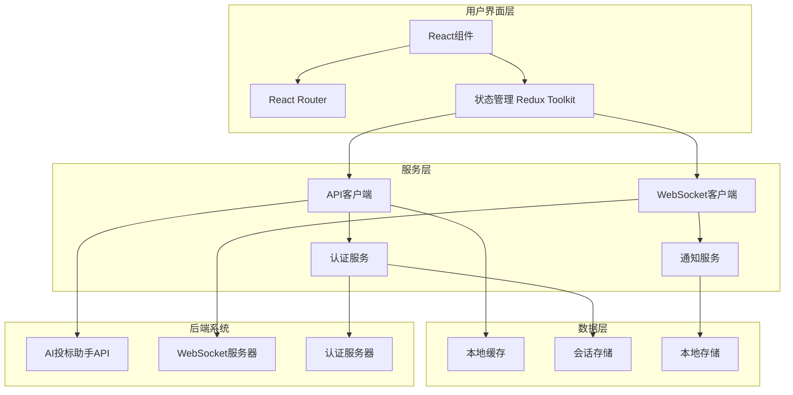

# AI投标助手Web界面设计文档

## 概述

AI投标助手Web界面是一个基于React的现代化单页应用(SPA)，为现有的AI投标助手后端系统提供直观、高效的用户界面。该界面采用组件化架构，支持实时数据更新、响应式设计和企业级安全要求。

系统通过RESTful API和WebSocket连接与Python后端通信，提供完整的投标文档处理工作流程，包括文档上传、AI分析、内容生成、人工审核和合规监控等功能。

## 架构

系统采用现代前端架构模式，具有清晰的层次结构和模块化设计：



### 核心架构原则

1. **组件化设计**: 可重用的React组件，遵循单一职责原则
2. **状态管理**: 集中式状态管理，确保数据一致性
3. **实时通信**: WebSocket实现实时状态更新和通知
4. **安全优先**: 多层安全验证和数据保护
5. **性能优化**: 代码分割、懒加载和缓存策略
6. **可访问性**: 遵循WCAG 2.1标准的无障碍设计

## 组件和接口

### 认证管理组件

**目的**: 处理用户认证、会话管理和权限控制

**核心组件**:
- `LoginForm`: 用户登录表单组件
- `AuthProvider`: 认证上下文提供者
- `ProtectedRoute`: 受保护路由组件
- `SessionManager`: 会话管理服务

**关键接口**:
```typescript
interface AuthService {
  login(credentials: LoginCredentials): Promise<AuthResult>
  logout(): Promise<void>
  refreshToken(): Promise<string>
  getCurrentUser(): User | null
  hasPermission(permission: Permission): boolean
}
```

**安全约束**:
- JWT令牌自动刷新机制
- 会话超时自动注销
- 基于角色的访问控制(RBAC)
- 安全的令牌存储和传输

### 项目管理组件

**目的**: 提供项目概览、创建和管理功能

**核心组件**:
- `Dashboard`: 主控制面板
- `ProjectList`: 项目列表组件
- `ProjectCard`: 项目卡片组件
- `ProjectCreator`: 新建项目组件
- `ProjectDetails`: 项目详情组件

**关键接口**:
```typescript
interface ProjectService {
  getProjects(): Promise<Project[]>
  createProject(projectData: CreateProjectRequest): Promise<Project>
  getProjectDetails(projectId: string): Promise<ProjectDetails>
  updateProject(projectId: string, updates: ProjectUpdate): Promise<Project>
  deleteProject(projectId: string): Promise<void>
}
```

**功能特性**:
- 项目状态实时更新
- 拖拽式项目排序
- 批量操作支持
- 高级筛选和搜索

### 文档管理组件

**目的**: 处理文档上传、预览和管理功能

**核心组件**:
- `DocumentUploader`: 文档上传组件
- `DocumentViewer`: 文档查看器
- `DocumentList`: 文档列表组件
- `UploadProgress`: 上传进度组件
- `DocumentPreview`: 文档预览组件

**关键接口**:
```typescript
interface DocumentService {
  uploadDocument(file: File, projectId: string): Promise<UploadResult>
  getDocuments(projectId: string): Promise<Document[]>
  getDocumentContent(documentId: string): Promise<DocumentContent>
  deleteDocument(documentId: string): Promise<void>
  downloadDocument(documentId: string): Promise<Blob>
}
```

**功能特性**:
- 拖拽式文件上传
- 多文件批量上传
- 实时上传进度显示
- 文档格式验证
- 在线文档预览

### 分析结果展示组件

**目的**: 可视化显示AI文档分析结果

**核心组件**:
- `AnalysisViewer`: 分析结果查看器
- `RequirementsList`: 需求列表组件
- `SectionHighlighter`: 章节高亮组件
- `ConfidenceIndicator`: 置信度指示器
- `TraceabilityViewer`: 可追溯性查看器

**关键接口**:
```typescript
interface AnalysisService {
  getAnalysisResult(documentId: string): Promise<AnalysisResult>
  getRequirements(documentId: string): Promise<Requirement[]>
  getEvaluationCriteria(documentId: string): Promise<EvaluationCriterion[]>
  flagAmbiguousContent(contentId: string, flag: AmbiguityFlag): Promise<void>
}
```

**可视化特性**:
- 交互式文档标注
- 需求分类颜色编码
- 置信度热力图
- 源文档位置链接

### 内容生成管理组件

**目的**: 管理AI内容生成流程和结果

**核心组件**:
- `ContentGenerator`: 内容生成器
- `TemplateSelector`: 模板选择器
- `GenerationProgress`: 生成进度组件
- `ContentEditor`: 内容编辑器
- `PlaceholderManager`: 占位符管理器

**关键接口**:
```typescript
interface ContentService {
  generateContent(request: ContentGenerationRequest): Promise<GenerationResult>
  getGeneratedContent(contentId: string): Promise<GeneratedContent>
  updateContent(contentId: string, updates: ContentUpdate): Promise<Content>
  getTemplates(): Promise<Template[]>
  validateContent(content: Content): Promise<ValidationResult>
}
```

**生成特性**:
- 实时生成进度跟踪
- 模板化内容生成
- 智能占位符检测
- 内容版本控制
- 源材料追溯

### 审核工作流程组件

**目的**: 提供直观的人工审核界面和工作流程管理

**核心组件**:
- `ReviewQueue`: 审核队列
- `ReviewPanel`: 审核面板
- `ContentComparison`: 内容对比组件
- `ApprovalActions`: 审批操作组件
- `ReviewHistory`: 审核历史组件

**关键接口**:
```typescript
interface ReviewService {
  getReviewQueue(reviewerId: string): Promise<ReviewItem[]>
  submitReview(reviewId: string, decision: ReviewDecision): Promise<ReviewResult>
  getReviewHistory(contentId: string): Promise<ReviewHistory[]>
  bulkReview(reviews: BulkReviewRequest[]): Promise<BulkReviewResult>
  escalateReview(reviewId: string, reason: string): Promise<void>
}
```

**审核特性**:
- 优先级排序队列
- 批量审核操作
- 内容变更对比
- 审核决定追踪
- 自动提醒机制

### 合规监控组件

**目的**: 实时监控系统合规状态和审计信息

**核心组件**:
- `ComplianceMonitor`: 合规监控器
- `AuditLogViewer`: 审计日志查看器
- `ComplianceReports`: 合规报告组件
- `ViolationAlerts`: 违规警告组件
- `TraceabilityGraph`: 追溯图表组件

**关键接口**:
```typescript
interface ComplianceService {
  getComplianceStatus(): Promise<ComplianceStatus>
  getAuditLogs(filters: AuditLogFilters): Promise<AuditLog[]>
  generateComplianceReport(params: ReportParameters): Promise<ComplianceReport>
  getViolations(): Promise<Violation[]>
  getTraceabilityChain(contentId: string): Promise<TraceabilityChain>
}
```

**监控特性**:
- 实时合规状态仪表板
- 可搜索审计日志
- 自动违规检测
- 可视化追溯链
- 合规报告生成

## 数据模型

### 核心数据结构

```typescript
// 用户和认证相关
interface User {
  id: string;
  username: string;
  email: string;
  role: UserRole;
  permissions: Permission[];
  lastLogin: Date;
  isActive: boolean;
}

interface AuthResult {
  user: User;
  accessToken: string;
  refreshToken: string;
  expiresIn: number;
}

// 项目管理相关
interface Project {
  id: string;
  name: string;
  description: string;
  status: ProjectStatus;
  createdAt: Date;
  updatedAt: Date;
  deadline: Date;
  workflowPhase: WorkflowPhase;
  progress: number;
  assignedUsers: User[];
}

interface ProjectDetails extends Project {
  documents: Document[];
  generatedContent: Content[];
  reviewItems: ReviewItem[];
  complianceStatus: ComplianceStatus;
}

// 文档相关
interface Document {
  id: string;
  filename: string;
  originalName: string;
  size: number;
  mimeType: string;
  uploadedAt: Date;
  uploadedBy: User;
  processingStatus: ProcessingStatus;
  analysisResult?: AnalysisResult;
}

interface AnalysisResult {
  id: string;
  documentId: string;
  extractedSections: DocumentSection[];
  requirements: Requirement[];
  evaluationCriteria: EvaluationCriterion[];
  ambiguityFlags: AmbiguityFlag[];
  confidenceScore: number;
  processingTime: number;
}

// 内容生成相关
interface GeneratedContent {
  id: string;
  type: ContentType;
  title: string;
  content: string;
  template: Template;
  sourceReferences: SourceReference[];
  placeholders: Placeholder[];
  generatedAt: Date;
  generatedBy: string;
  reviewStatus: ReviewStatus;
  version: number;
}

interface Template {
  id: string;
  name: string;
  description: string;
  category: TemplateCategory;
  structure: TemplateStructure;
  variables: TemplateVariable[];
  isActive: boolean;
}

// 审核相关
interface ReviewItem {
  id: string;
  contentId: string;
  content: GeneratedContent;
  reviewType: ReviewType;
  priority: Priority;
  assignedTo: User;
  status: ReviewStatus;
  createdAt: Date;
  dueDate: Date;
  comments: ReviewComment[];
}

interface ReviewDecision {
  decision: 'approve' | 'reject' | 'modify';
  comments: string;
  modifications?: ContentModification[];
  reviewerId: string;
  timestamp: Date;
}

// 合规和审计相关
interface ComplianceStatus {
  overall: 'compliant' | 'warning' | 'violation';
  lastChecked: Date;
  violations: Violation[];
  warnings: Warning[];
  score: number;
}

interface AuditLog {
  id: string;
  timestamp: Date;
  operation: string;
  actor: User;
  resource: string;
  details: Record<string, any>;
  result: 'success' | 'failure' | 'blocked';
  traceabilityChain: string[];
}
```

### 状态管理结构

```typescript
interface AppState {
  auth: AuthState;
  projects: ProjectsState;
  documents: DocumentsState;
  content: ContentState;
  reviews: ReviewsState;
  compliance: ComplianceState;
  notifications: NotificationsState;
  ui: UIState;
}

interface AuthState {
  user: User | null;
  isAuthenticated: boolean;
  isLoading: boolean;
  error: string | null;
}

interface ProjectsState {
  projects: Project[];
  currentProject: ProjectDetails | null;
  isLoading: boolean;
  error: string | null;
  filters: ProjectFilters;
}
```

## 正确性属性

*属性是在系统的所有有效执行中都应该成立的特征或行为——本质上是关于系统应该做什么的正式声明。属性作为人类可读规范和机器可验证正确性保证之间的桥梁。*

<function_calls>
<invoke name="prework">
<parameter name="featureName">web-interface

基于预工作分析，我已经识别出大多数验收标准都可以作为属性进行测试。在审查冗余性后，我可以合并一些相关属性，同时保持全面覆盖。

### 属性反思

在分析所有验收标准后，几个属性可以合并：
- 属性2.1、2.4和2.5都与仪表板显示相关，可以合并为综合显示属性
- 属性3.2、3.3和3.4都与文档管理相关，可以合并为综合文档处理属性
- 属性4.1、4.2、4.3、4.4和4.5都与分析结果显示相关，可以合并为综合分析展示属性

### 用户认证属性

**属性1: 有效凭据认证**
*对于任何*有效的用户凭据，系统应该成功建立会话并重定向到主控制面板
**验证需求: 需求1.2**

**属性2: 基于角色的访问控制**
*对于任何*用户角色和功能请求，系统应该根据用户权限正确控制访问
**验证需求: 需求1.4**

### 项目管理属性

**属性3: 仪表板综合显示**
*对于任何*项目集合和系统状态，仪表板应该正确显示所有活跃项目、实时进度状态和系统健康信息
**验证需求: 需求2.1, 2.4, 2.5**

**属性4: 项目选择响应**
*对于任何*项目选择操作，系统应该显示该项目的完整详细信息和当前工作流程阶段
**验证需求: 需求2.2**

### 文档管理属性

**属性5: 文档处理完整性**
*对于任何*文档上传操作，系统应该显示上传进度、验证文件、更新文档列表并支持预览功能
**验证需求: 需求3.2, 3.3, 3.4**

### 分析结果属性

**属性6: 分析结果综合展示**
*对于任何*文档分析结果，系统应该完整显示提取的章节、高亮要求、标记模糊内容、提供追溯链接和显示置信度评分
**验证需求: 需求4.1, 4.2, 4.3, 4.4, 4.5**

### 内容生成属性

**属性7: 模板和内容显示**
*对于任何*内容生成请求，系统应该显示可用模板、生成进度、标记占位符并提供编辑功能
**验证需求: 需求5.1, 5.2, 5.3, 5.4**

**属性8: 源材料追溯**
*对于任何*生成的内容，系统应该显示完整的源材料追溯信息和生成元数据
**验证需求: 需求5.5**

### 审核工作流程属性

**属性9: 审核队列管理**
*对于任何*待审核内容集合，系统应该按优先级和截止日期正确排序并显示
**验证需求: 需求6.1**

**属性10: 审核内容展示**
*对于任何*审核内容选择，系统应该显示内容详情、源材料和生成上下文
**验证需求: 需求6.2**

**属性11: 审核历史记录**
*对于任何*审核决定，系统应该完整记录并维护审核历史
**验证需求: 需求6.4**

### 合规监控属性

**属性12: 合规状态监控**
*对于任何*系统状态，合规监控器应该实时显示合规状态、违规警告、被阻止操作和风险检测结果
**验证需求: 需求7.1, 7.3**

**属性13: 审计日志管理**
*对于任何*审计日志查询，系统应该提供详细的日志查看功能并支持多维度筛选
**验证需求: 需求7.2**

**属性14: 审计追踪可视化**
*对于任何*内容生成链路，系统应该提供完整的可视化审计追踪展示
**验证需求: 需求7.5**

### 工作流程管理属性

**属性15: 工作流程状态展示**
*对于任何*项目工作流程，系统应该显示当前阶段、进度百分比、可视化表示和时间信息
**验证需求: 需求8.1, 8.2, 8.3**

**属性16: 工作流程操作控制**
*对于任何*授权用户的工作流程操作，系统应该正确验证权限并允许阶段推进
**验证需求: 需求8.4**

### 实时通信属性

**属性17: 实时通知管理**
*对于任何*系统事件，应该生成相应的实时通知并支持优先级分类和自动消失机制
**验证需求: 需求9.1, 9.2**

### 响应式设计属性

**属性18: 跨设备一致性**
*对于任何*设备类型和浏览器，系统应该提供一致的用户体验和功能
**验证需求: 需求10.1, 10.5**

**属性19: 可访问性标准遵循**
*对于任何*可访问性要求，系统应该遵循WCAG 2.1 AA级标准
**验证需求: 需求10.3**

### 数据导出属性

**属性20: 报告自定义和生成**
*对于任何*报告请求，系统应该支持自定义模板、内容选择并生成包含审计追踪的完整报告
**验证需求: 需求11.2, 11.3**

**属性21: 导出进度管理**
*对于任何*导出操作，系统应该显示进度并支持后台处理
**验证需求: 需求11.5**

### 系统管理属性

**属性22: 用户管理操作**
*对于任何*用户管理操作，系统应该支持创建、编辑和禁用用户账户的完整功能
**验证需求: 需求12.2**

**属性23: 系统监控显示**
*对于任何*系统状态查询，应该显示准确的性能指标和资源使用情况
**验证需求: 需求12.4**

## 错误处理

系统实现全面的错误处理策略，涵盖前端特有的错误场景：

### 错误分类和响应

1. **网络错误**
   - API请求失败 → 自动重试机制和用户友好提示
   - WebSocket连接中断 → 自动重连和离线模式
   - 超时错误 → 进度指示和取消选项

2. **用户输入错误**
   - 表单验证失败 → 实时验证和错误高亮
   - 文件格式错误 → 清晰的格式要求说明
   - 权限不足 → 友好的权限说明和申请流程

3. **应用状态错误**
   - 组件渲染失败 → 错误边界和降级显示
   - 状态不一致 → 自动状态同步和数据刷新
   - 路由错误 → 404页面和导航建议

4. **性能相关错误**
   - 内存不足 → 数据分页和虚拟滚动
   - 加载超时 → 骨架屏和加载优化
   - 大文件处理 → 分块上传和进度显示

### 错误恢复机制

- **自动重试**: 网络请求失败时的指数退避重试
- **状态恢复**: 页面刷新后的状态自动恢复
- **数据同步**: 离线操作的自动同步机制
- **用户引导**: 错误发生时的操作建议和帮助链接

## 测试策略

Web界面需要综合的测试方法，结合单元测试和属性测试来确保用户界面的正确性和可靠性。

### 属性测试框架

**框架选择**: 我们将使用 **fast-check** 进行TypeScript/JavaScript的属性测试，它提供：
- 丰富的数据生成器
- 自动测试用例缩减
- 与Jest/Vitest的无缝集成
- 异步操作支持

**测试配置**:
- 每个属性测试最少100次迭代
- 每个测试标记为: **Feature: web-interface, Property {number}: {property_text}**
- 全面的测试输入和结果日志
- 失败案例的自动回归测试生成

### 单元测试策略

单元测试将专注于：
- **组件行为**: React组件的渲染和交互测试
- **状态管理**: Redux store和reducer的逻辑测试
- **API集成**: API客户端和数据转换测试
- **用户交互**: 用户操作流程和事件处理测试

### 端到端测试

**工具选择**: 使用 **Playwright** 进行端到端测试：
- 跨浏览器兼容性测试
- 真实用户场景模拟
- 可访问性自动化测试
- 性能和加载时间测试

### 测试数据管理

**模拟数据生成**:
- 真实的用户角色和权限数据集
- 各种复杂度的项目和文档数据
- 不同状态的工作流程场景
- 边界条件和错误场景数据

**测试环境隔离**:
- 独立的测试API环境
- 模拟的WebSocket服务
- 可控的认证和权限系统
- 可重现的测试场景

### 可访问性测试

**自动化可访问性验证**:
- WCAG 2.1 AA级标准自动检查
- 键盘导航路径验证
- 屏幕阅读器兼容性测试
- 颜色对比度和字体大小测试

**用户体验测试**:
- 不同设备和屏幕尺寸测试
- 网络条件变化下的性能测试
- 用户操作流程的完整性验证
- 错误恢复和用户引导测试

测试策略确保所有正确性属性通过自动化属性测试得到验证，同时单元测试和端到端测试提供具体的用例覆盖和用户体验验证。这种综合方法提供了Web界面正确性和用户体验的全面验证。